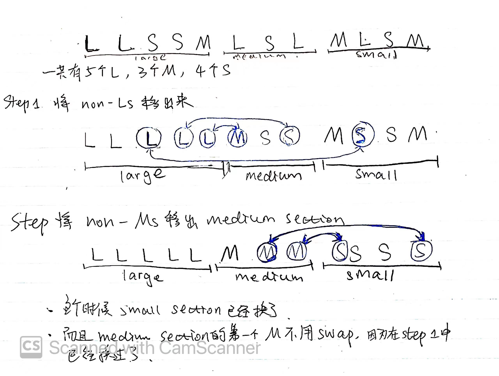

## Thoughts
1. 先算出input的三个sections的长度：Larget section, Medium section, Small section
2. 将input中Large section中`non_Ls`移出来，将Medium Section中`non_Ms`移出来，再不算上`min(Ms in Large section, Ls in Medium section)`
3. 剩下的Small section就已经排好了

## Graphs

